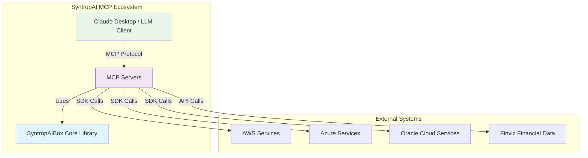
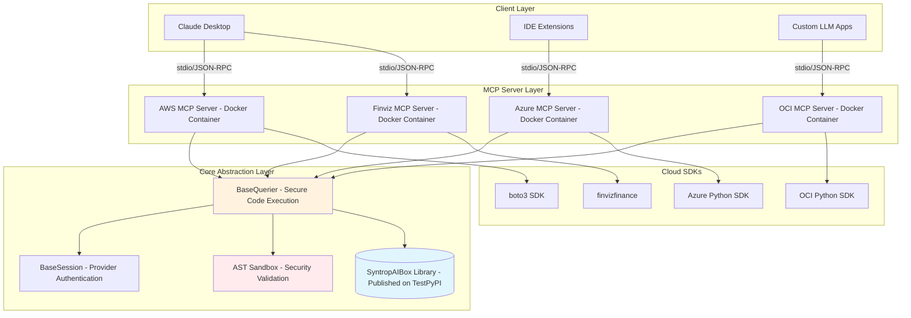
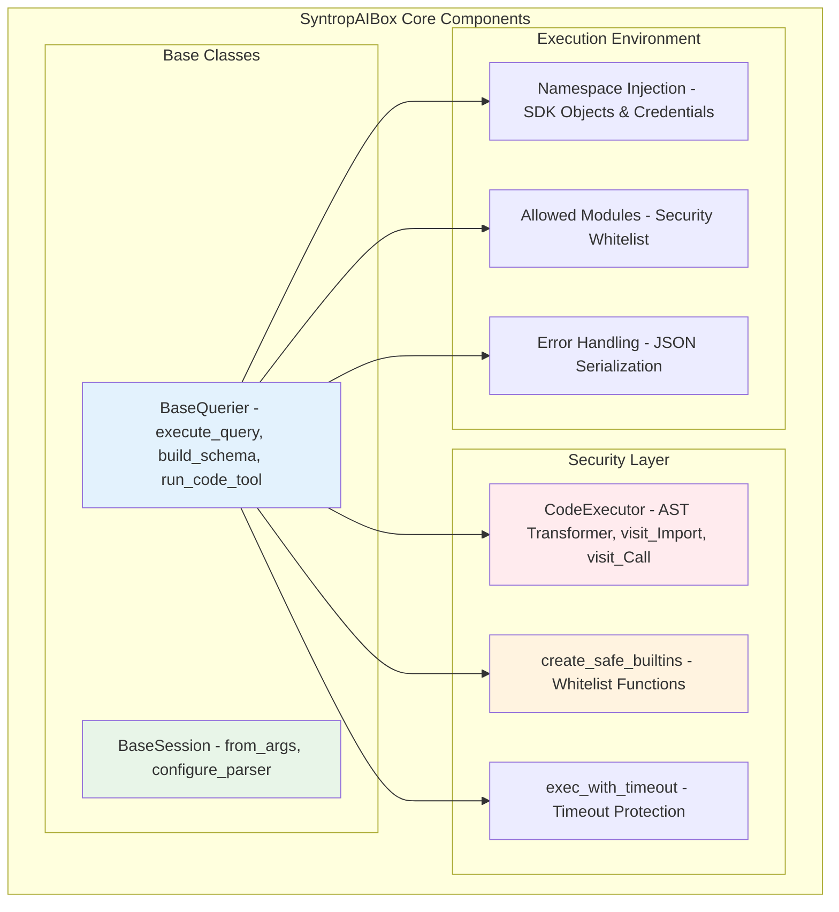
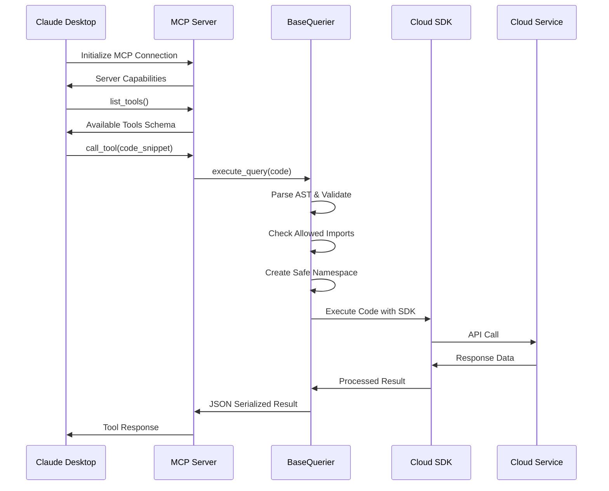
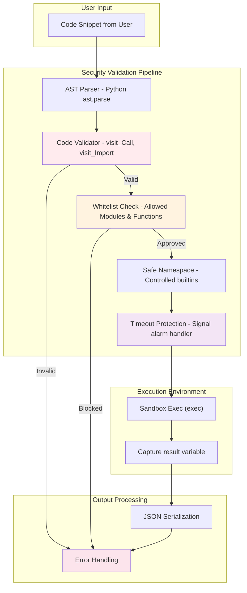
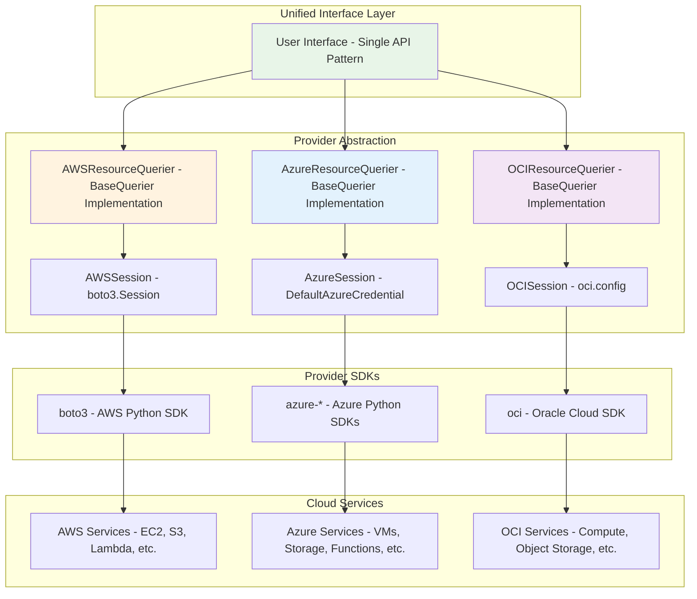
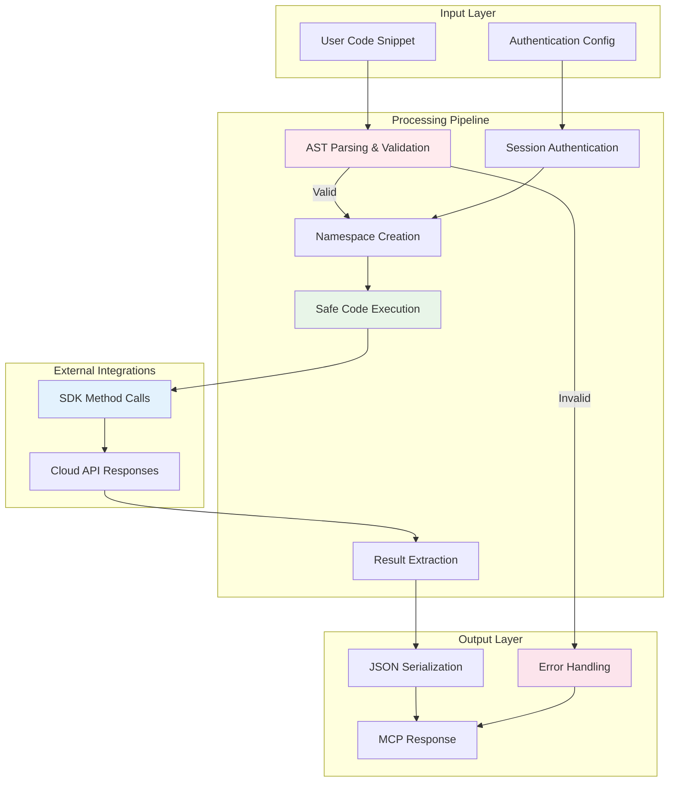
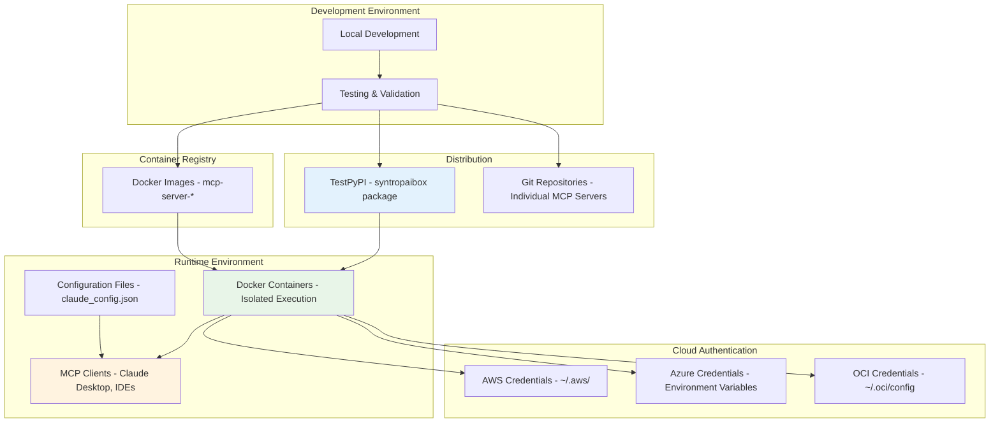

# SyntropAI MCP Ecosystem - Architecture Diagrams

## System Context (C4 Level 1)



## Container Diagram (C4 Level 2)



## Component Architecture



## MCP Protocol Flow



## Security Architecture



## Multi-Cloud Abstraction Pattern



## Data Flow Architecture



## Deployment Architecture



## Key Architectural Principles

### 1. **Abstraction Layers**
- **Interface Layer**: Consistent MCP protocol implementation
- **Business Logic**: Provider-agnostic query execution
- **Infrastructure Layer**: Provider-specific SDK integration

### 2. **Security by Design**
- **Input Validation**: AST-based code analysis
- **Execution Isolation**: Sandboxed environments
- **Access Control**: Whitelisted modules and functions

### 3. **Extensibility**
- **Plugin Architecture**: Easy addition of new providers
- **Configuration-Driven**: Runtime behavior modification
- **Schema Generation**: Dynamic API documentation

### 4. **Resilience**
- **Error Boundaries**: Comprehensive exception handling
- **Timeout Protection**: Resource usage limits
- **Graceful Degradation**: Partial failure handling

## Implementation Details

### Abstract Base Classes
Each cloud provider implements the same interface:
```python
class BaseSession(ABC):
    @classmethod
    @abstractmethod
    def from_args(cls, args: argparse.Namespace) -> "BaseSession":
        """Instantiate session using parsed CLI/environment arguments"""
        
    @classmethod
    @abstractmethod
    def configure_parser(cls, parser: argparse.ArgumentParser):
        """Inject provider-specific CLI options"""
```

### Provider Integration Pattern
```python
class AWSResourceQuerier(BaseQuerier):
    def __init__(self):
        namespace = {
            "boto3": boto3,
            "session": session.session,
        }
        allowed_module_prefixes = ('boto3',)
        custom_modules = DEFAULT_ALLOWED_MODULES.union({""})
        
        super().__init__(allowed_module_prefixes, custom_modules, namespace)
```

### Execution Flow
```python
# LLM generates code based on user request
code_snippet = """
import boto3
ec2 = session.client('ec2')
result = ec2.describe_instances()
"""
# SyntropAI safely executes and returns results
```

## Project Structure

```
syntropai-mcp-ecosystem/
├── sytropaibox/                 # Core abstraction library
│   ├── syntropaibox/
│   │   └── mcp/
│   │       ├── base.py         # BaseQuerier & BaseSession classes
│   │       └── sandbox.py      # Secure execution environment
│   └── pyproject.toml          # Published to TestPyPI
├── mcp-server-for-aws/         # AWS MCP server
├── mcp-server-azure/           # Azure MCP server  
├── mcp-server-oci/             # Oracle Cloud MCP server
└── mcp_finviz/                 # Financial data MCP server
```

## Technical Advantages

### 1. Non-Hardcoded Service Catalog
- Traditional solutions implement fixed service lists
- SyntropAI supports any service through dynamic SDK access
- Future services work immediately without updates

### 2. Provider-Agnostic Architecture
- Same codebase pattern across all clouds
- Easy addition of new providers (GCP, etc.)
- Consistent developer experience

### 3. Security-First Design
- AST-based validation prevents code injection
- Sandboxed execution environment
- Controlled module imports

### 4. Production-Ready Features
- Docker containerization
- Environment-based configuration
- Comprehensive error handling
- Logging and monitoring hooks

## Extensibility Points

1. **New Cloud Providers**: Implement BaseSession interface
2. **New Service Types**: Add to allowed modules list
3. **Enhanced Security**: Extend AST validation rules
4. **Performance Optimization**: Plugin-based caching layers

## API Evolution Handling

- Dynamic schema generation adapts to API changes
- Loose coupling prevents breaking changes
- Version-agnostic service discovery

These diagrams illustrate how the SyntropAI MCP ecosystem provides a unified, secure, and extensible platform for multi-cloud resource management through intelligent abstraction and robust security mechanisms.