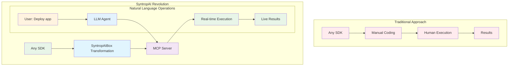
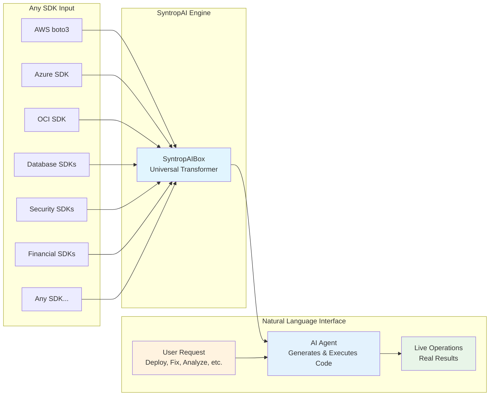
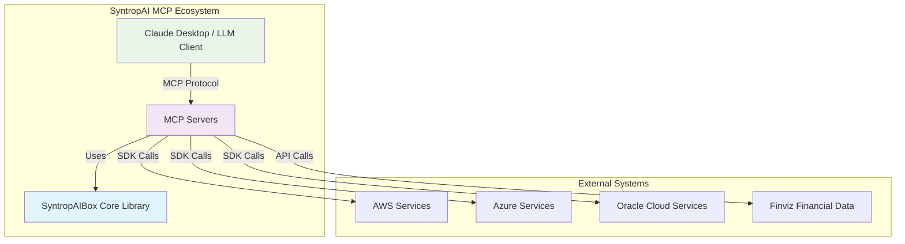
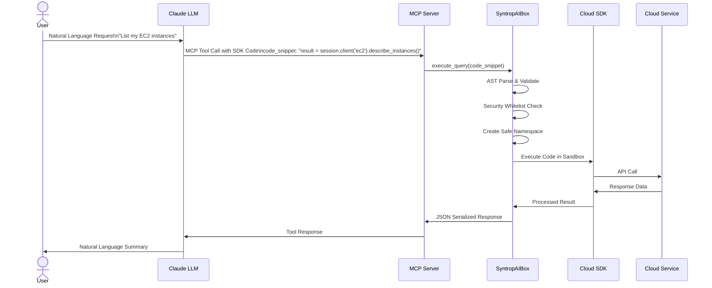
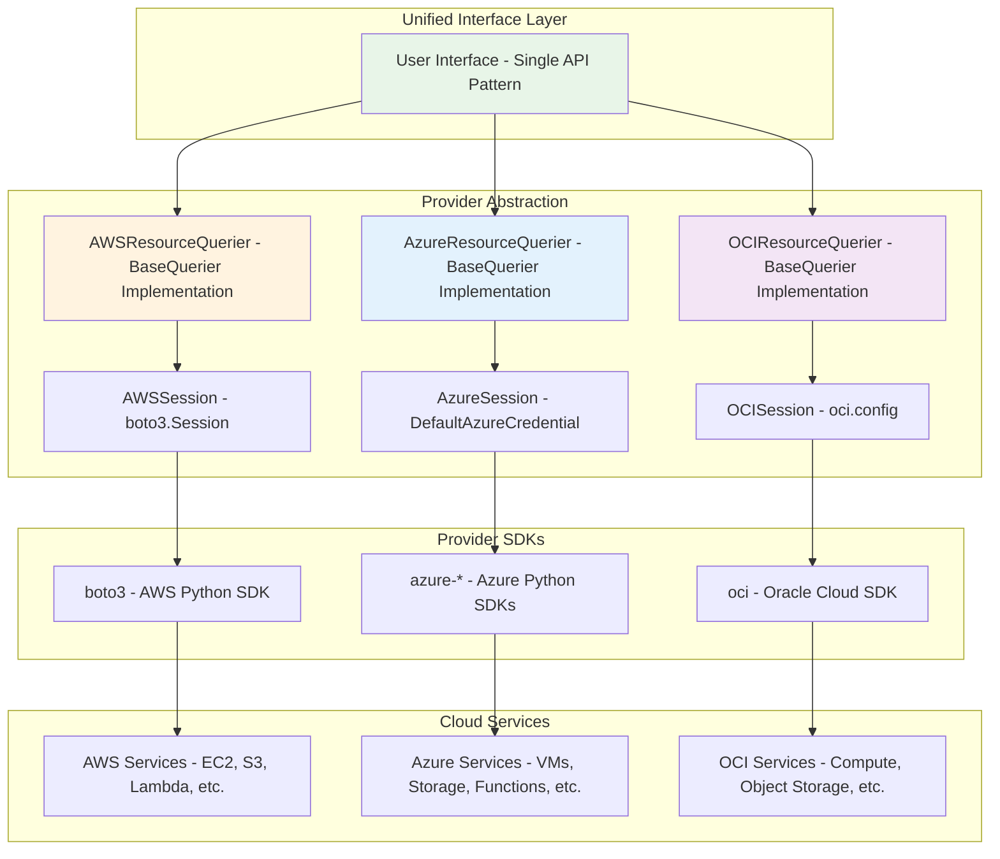

# SyntropAI MCP Ecosystem: Universal SDK-to-MCP Transformation Framework

## Overview

### The SyntropAI Transformation Concept



### Universal SDK-to-Operations Transformation



**Revolutionary Capability**: Transform any Python SDK into natural language operations - no coding knowledge required, AI agents execute real operations autonomously.

## 🚀 Key Innovation: The SyntropAI Abstraction Pattern

### Core Architecture Philosophy

The project implements a sophisticated abstraction pattern that solves several critical challenges in multi-cloud and multi-service environments:

1. **Service-Agnostic Interface**: Single codebase supporting multiple cloud providers without hardcoded service catalogs
2. **Future-Proof Design**: Accommodates new services and API changes without breaking existing implementations
3. **Secure Code Execution**: AST-based sandboxing ensures safe execution of dynamic queries
4. **Unified Authentication**: Abstract session management across different cloud authentication mechanisms

## 🏗️ Architecture Components

### 1. SyntropAIBox Core Library (`syntropaibox`)

**Published Package**: [syntropaibox on TestPyPI](https://test.pypi.org/project/syntropaibox/)

The core abstraction library that powers all MCP servers:

#### Key Features:
- **BaseQuerier**: Abstract query execution engine with secure AST parsing
- **BaseSession**: Unified session management across cloud providers  
- **Secure Sandbox**: Safe code execution with whitelisted modules and timeout protection
- **Dynamic Schema Generation**: Runtime schema creation for different SDKs


### 2. SDK-to-MCP Server Demonstrations

The framework has been proven with diverse SDKs, showcasing its universal applicability:

#### Cloud Infrastructure Operations
- **[AWS MCP Server](https://github.com/simplificare-org/mcp-server-for-aws)**: Complete AWS operations via boto3
- **[Azure MCP Server](https://github.com/simplificare-org/mcp-server-azure)**: Full Azure ecosystem via Azure SDK
- **[Oracle Cloud (OCI) MCP Server](https://github.com/simplificare-org/mcp-server-oci)**: OCI operations via OCI SDK

#### Financial & Compliance Operations  
- **[Finviz MCP Server](https://github.com/simplificare-org/mcp_finviz)**: Market analysis via finvizfinance SDK
- **[OSCAL MCP Server](https://github.com/simplificare-org/mcp-server-oscal)**: Security compliance via OSCAL frameworks

#### Universal SDK Integration
Any Python SDK can be transformed into an MCP server:
- **Security SDKs**: CyberArk, HashiCorp Vault, etc.
- **Monitoring SDKs**: DataDog, New Relic, Prometheus
- **Database SDKs**: MongoDB, PostgreSQL, Redis
- **Communication SDKs**: Slack, Teams, Discord
- **Analytics SDKs**: Snowflake, BigQuery, Databricks

## 🏗️ System Architecture

### High-Level System Overview



### MCP Protocol Flow




### Multi-Cloud Abstraction Pattern



## 🌟 Platform Benefits

### For Business Users
- **No Technical Barrier**: Manage complex infrastructure through simple conversations
- **Instant Operations**: Deploy, troubleshoot, and optimize through natural language
- **Universal Access**: Same interface works across all cloud providers and services
- **Cost Efficiency**: Reduce need for specialized technical teams

### For Organizations
- **Democratized Operations**: Any team member can perform complex tasks
- **Vendor Independence**: Easy switching between cloud providers
- **Future-Proof**: New services automatically available through AI
- **Risk Reduction**: Secure, validated operations with built-in safety

### For Developers
- **Rapid Prototyping**: Transform any SDK into AI-accessible operations
- **Extensible Framework**: Add new services and platforms easily  
- **Production Ready**: Enterprise-grade security and deployment
- **Open Source**: Community-driven development and innovation

## 📋 Natural Language to Operations

### No Code Knowledge Required
Users interact through natural language, AI handles all the complexity:

**User Request**: *"Deploy a secure web application environment on AWS"*

**Behind the Scenes**: LLM generates and SyntropAI executes:
```python
# Generated automatically by LLM based on user request
vpc = ec2.create_vpc(CidrBlock='10.0.0.0/16')
subnet = ec2.create_subnet(VpcId=vpc.id, CidrBlock='10.0.1.0/24')
security_group = ec2.create_security_group(GroupName='web-sg', Description='Web Security Group')
result = ec2.run_instances(ImageId='ami-12345', MinCount=1, MaxCount=1)
```

**User Request**: *"My application is running slowly, please fix it"*

**Behind the Scenes**: LLM analyzes and executes:
```python
# AI generates diagnostic and remediation code
metrics = monitor_client.metrics.list(resource_uri)
if metrics.cpu_percent > 80:
    result = compute_client.virtual_machine_scale_sets.scale_up()
```

**User Request**: *"Run a security compliance audit on our infrastructure"*

**Behind the Scenes**: AI generates comprehensive assessment:
```python
# Automatically generated security audit code
assessment = oscal.create_assessment_plan()
findings = assessment.execute_controls()
result = assessment.generate_compliance_report()
```

**User Request**: *"What are the best tech stocks to invest in right now?"*

**Behind the Scenes**: AI performs market analysis:
```python
# Financial analysis code generated by AI
screener = finvizfinance.Screener()
tech_stocks = screener.set_filter(sector='Technology', pe='Under 20')
result = tech_stocks.performance_analysis()
```

### The Power of Natural Language Operations

- ✅ **No Programming Required**: Users speak naturally, AI generates executable SDK code
- ✅ **Real SDK Execution**: LLM has direct access to all SDK functions and methods
- ✅ **Dynamic Code Generation**: AI creates context-appropriate code using actual APIs  
- ✅ **Live Operations**: Code executes immediately with full operational capabilities
- ✅ **Cross-Platform**: Same natural language works across all cloud providers and services
- ✅ **Complete SDK Access**: Unlike code assistants, AI can execute any SDK operation autonomously

## 🚀 Getting Started

### Quick Installation
```bash
# Install core library
pip install -i https://test.pypi.org/simple/ syntropaibox

# Or use Docker for MCP servers
docker build -t mcp-server-aws-resources ./mcp-server-for-aws
docker run -i --rm -e AWS_PROFILE=default mcp-server-aws-resources
```

### Integration with Claude Desktop
```json
{
  "mcpServers": {
    "aws-resources": {
      "command": "docker",
      "args": ["run", "-i", "--rm", "mcp-server-aws-resources:latest"]
    }
  }
}
```


## 📊 Architecture Diagrams

For detailed system architecture, component relationships, and data flow diagrams, see [ARCHITECTURE.md](./ARCHITECTURE.md) which includes:

- **C4 Context & Container Diagrams**: High-level system overview
- **Component Architecture**: Internal structure of SyntropAIBox
- **Security Architecture**: AST validation and sandboxing flow  
- **Multi-Cloud Abstraction Pattern**: Provider-agnostic design
- **MCP Protocol Flow**: Sequence diagrams for client-server interactions
- **Deployment Architecture**: Container and distribution strategy

## 📚 Repository Links

- **Core Library**: [syntropaibox](https://test.pypi.org/project/syntropaibox/)
- **Individual MCP Servers**: Each maintained in separate repositories for modularity
- **Documentation Project**: This repository serves as the central documentation hub

## 📞 Contact

For more information about SyntropAI and enterprise solutions:  
**Website**: [about.simplificare.ch](https://about.simplificare.ch)  
**GitHub**: [simplificare-org](https://github.com/simplificare-org)

---

*This project represents the cutting edge of cloud abstraction technology, demonstrating how thoughtful architecture can solve complex integration challenges while maintaining security, performance, and extensibility.*