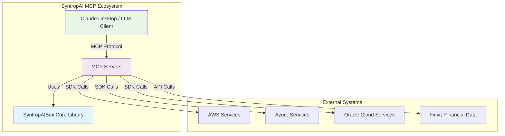
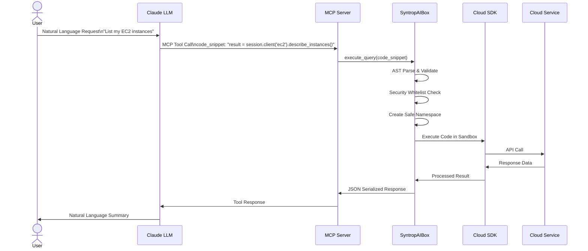
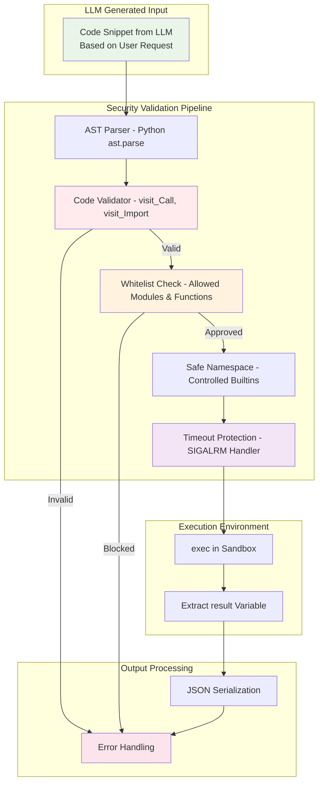
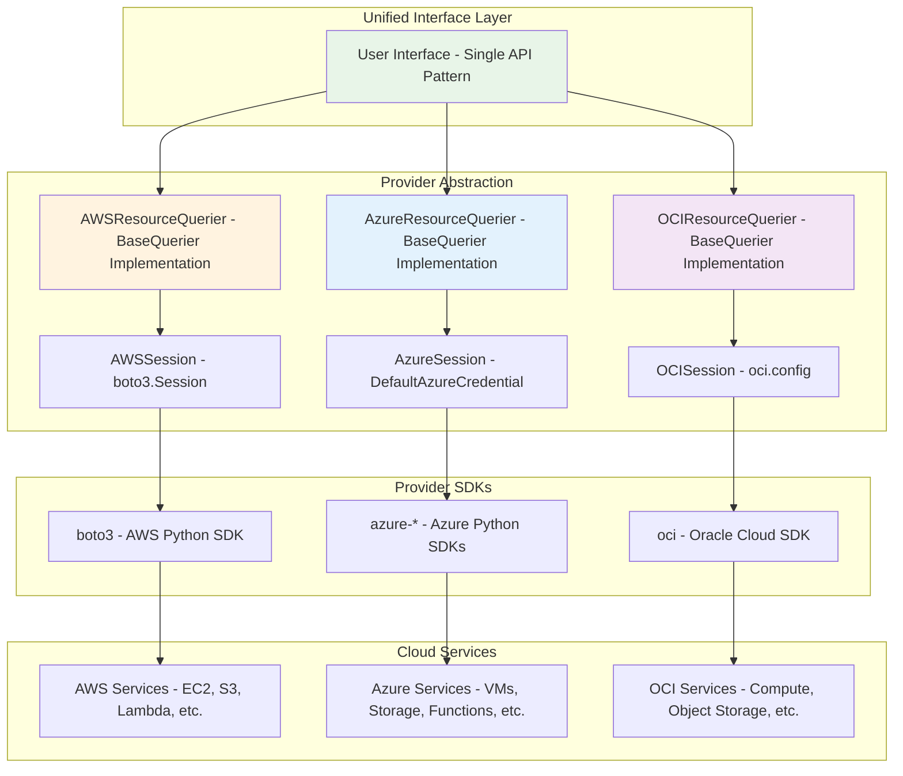

# SyntropAI MCP Ecosystem: Universal SDK-to-MCP Transformation Framework

## Overview

The SyntropAI MCP (Model Context Protocol) Ecosystem is a revolutionary framework that transforms **any SDK** into secure MCP servers, empowering AI agents and LLM workflows with complete operational capabilities. This is not just a multi-cloud abstraction—it's a universal platform that can wrap any Python SDK and expose all its functions to AI agents for autonomous operations.

**SyntropAIBox** serves as the core transformation engine that can reincarnate any SDK as an MCP server, enabling AI agents to perform:
- **Provisioning**: Deploy and configure services across any platform
- **Troubleshooting**: Diagnose and resolve issues autonomously  
- **DevOps**: Automate deployment, monitoring, and maintenance
- **SecOps**: Security operations and compliance management
- **FinOps**: Financial operations and cost optimization

## 🚀 Key Innovation: The SyntropAI Abstraction Pattern

### Core Architecture Philosophy

The project implements a sophisticated abstraction pattern that solves several critical challenges in multi-cloud and multi-service environments:

1. **Service-Agnostic Interface**: Single codebase supporting multiple cloud providers without hardcoded service catalogs
2. **Future-Proof Design**: Accommodates new services and API changes without breaking existing implementations
3. **Secure Code Execution**: AST-based sandboxing ensures safe execution of dynamic queries
4. **Unified Authentication**: Abstract session management across different cloud authentication mechanisms

## 🏗️ Architecture Components

### 1. SyntropAIBox Core Library (`syntropaibox`)

**Published Package**: [syntropaibox on TestPyPI](https://test.pypi.org/project/syntropaibox/)

The core abstraction library that powers all MCP servers:

#### Key Features:
- **BaseQuerier**: Abstract query execution engine with secure AST parsing
- **BaseSession**: Unified session management across cloud providers  
- **Secure Sandbox**: Safe code execution with whitelisted modules and timeout protection
- **Dynamic Schema Generation**: Runtime schema creation for different SDKs

#### Technical Highlights:
```python
# Safe code execution with AST validation
class CodeExecutor(ast.NodeTransformer):
    def visit_Call(self, node):
        if isinstance(node.func, ast.Name) and node.func.id in {"eval", "exec", "compile"}:
            raise ValueError(f"Usage of '{node.func.id}' is not allowed.")
        return self.generic_visit(node)
```

### 2. SDK-to-MCP Server Demonstrations

The framework has been proven with diverse SDKs, showcasing its universal applicability:

#### Cloud Infrastructure Operations
- **[AWS MCP Server](https://github.com/simplificare-org/mcp-server-for-aws)**: Complete AWS operations via boto3
- **[Azure MCP Server](https://github.com/simplificare-org/mcp-server-azure)**: Full Azure ecosystem via Azure SDK
- **[Oracle Cloud (OCI) MCP Server](https://github.com/simplificare-org/mcp-server-oci)**: OCI operations via OCI SDK

#### Financial & Compliance Operations  
- **[Finviz MCP Server](https://github.com/simplificare-org/mcp_finviz)**: Market analysis via finvizfinance SDK
- **[OSCAL MCP Server](https://github.com/simplificare-org/mcp-server-oscal)**: Security compliance via OSCAL frameworks

#### Universal SDK Integration
Any Python SDK can be transformed into an MCP server:
- **Security SDKs**: CyberArk, HashiCorp Vault, etc.
- **Monitoring SDKs**: DataDog, New Relic, Prometheus
- **Database SDKs**: MongoDB, PostgreSQL, Redis
- **Communication SDKs**: Slack, Teams, Discord
- **Analytics SDKs**: Snowflake, BigQuery, Databricks

## 🏗️ System Architecture

### High-Level System Overview



### MCP Protocol Flow



### Security Architecture Pipeline



### Multi-Cloud Abstraction Pattern



## 🎯 Technical Excellence

### 1. Abstract Base Classes
Each cloud provider implements the same interface:
```python
class BaseSession(ABC):
    @classmethod
    @abstractmethod
    def from_args(cls, args: argparse.Namespace) -> "BaseSession":
        """Instantiate session using parsed CLI/environment arguments"""
        
    @classmethod
    @abstractmethod
    def configure_parser(cls, parser: argparse.ArgumentParser):
        """Inject provider-specific CLI options"""
```

### 2. Secure Code Execution
- AST-based code validation prevents malicious code execution
- Whitelisted imports and builtins
- Timeout protection for long-running operations
- Safe namespace isolation

### 3. Dynamic Service Discovery
Unlike hardcoded service catalogs, the system allows:
- Runtime discovery of available services
- Dynamic API adaptation
- Future service support without code changes

### 4. Unified Error Handling
Consistent error responses across all providers with JSON serialization

## 🔧 Implementation Pattern

### Provider Integration Example (AWS):
```python
class AWSResourceQuerier(BaseQuerier):
    def __init__(self):
        namespace = {
            "boto3": boto3,
            "session": session.session,
        }
        allowed_module_prefixes = ('boto3',)
        custom_modules = DEFAULT_ALLOWED_MODULES.union({""})
        
        super().__init__(allowed_module_prefixes, custom_modules, namespace)
```

### Usage Pattern:
```python
# User submits code snippet
code_snippet = """
import boto3
ec2 = session.client('ec2')
result = ec2.describe_instances()
"""
# System safely executes and returns results
```

## 📦 Project Structure

```
documentation-syntropai/
├── sytropaibox/                 # Core abstraction library
│   ├── syntropaibox/
│   │   └── mcp/
│   │       ├── base.py         # BaseQuerier & BaseSession classes
│   │       └── sandbox.py      # Secure execution environment
│   └── pyproject.toml          # Published to TestPyPI
├── mcp-server-for-aws/         # AWS MCP server
├── mcp-server-azure/           # Azure MCP server  
├── mcp-server-oci/             # Oracle Cloud MCP server
└── mcp_finviz/                 # Financial data MCP server
```

## 🌟 Competitive Advantages

### 1. **Non-Hardcoded Service Catalog**
- Traditional solutions implement fixed service lists
- SyntropAI supports any service through dynamic SDK access
- Future services work immediately without updates

### 2. **Provider-Agnostic Architecture**
- Same codebase pattern across all clouds
- Easy addition of new providers (GCP, etc.)
- Consistent developer experience

### 3. **Security-First Design**
- AST-based validation prevents code injection
- Sandboxed execution environment
- Controlled module imports

### 4. **Production-Ready Features**
- Docker containerization
- Environment-based configuration
- Comprehensive error handling
- Logging and monitoring hooks

## 🔮 Future-Proof Design

### Extensibility Points:
1. **New Cloud Providers**: Implement BaseSession interface
2. **New Service Types**: Add to allowed modules list
3. **Enhanced Security**: Extend AST validation rules
4. **Performance Optimization**: Plugin-based caching layers

### API Evolution Handling:
- Dynamic schema generation adapts to API changes
- Loose coupling prevents breaking changes
- Version-agnostic service discovery

## 📈 Business Impact

### For DevOps Teams:
- **Reduced Complexity**: Single interface for multi-cloud operations
- **Faster Deployment**: Reusable patterns across providers
- **Lower Maintenance**: Abstract away provider-specific details

### For Organizations:
- **Vendor Independence**: Easy cloud provider switching
- **Future-Proofing**: Accommodates new services automatically  
- **Cost Optimization**: Unified tooling reduces operational overhead

## 🏆 Technical Achievements

1. **Advanced Abstraction**: Clean separation between interface and implementation
2. **Security Innovation**: AST-based safe code execution
3. **Scalable Architecture**: Plugin-based extensibility
4. **Production Deployment**: Containerized, configurable solutions
5. **Open Source Ready**: Modular design for community contributions

## 📋 AI Agent Use Cases

### Infrastructure Provisioning
```python
# AI Agent autonomously provisions cloud resources
await aws_server.call_tool("provision_infrastructure", {
    "code_snippet": """
    # Create VPC, subnets, security groups, and EC2 instances
    vpc = ec2.create_vpc(CidrBlock='10.0.0.0/16')
    subnet = ec2.create_subnet(VpcId=vpc.id, CidrBlock='10.0.1.0/24')
    result = ec2.run_instances(ImageId='ami-12345', MinCount=1, MaxCount=1)
    """
})
```

### Autonomous Troubleshooting  
```python
# AI Agent diagnoses and resolves issues
await azure_server.call_tool("troubleshoot_application", {
    "code_snippet": """
    # Check application health, identify bottlenecks, auto-scale
    metrics = monitor_client.metrics.list(resource_uri)
    if metrics.cpu_percent > 80:
        result = compute_client.virtual_machine_scale_sets.scale_up()
    """
})
```

### Security Operations
```python
# AI Agent performs security compliance checks
await oscal_server.call_tool("compliance_assessment", {
    "code_snippet": """
    # Automated security posture assessment
    assessment = oscal.create_assessment_plan()
    findings = assessment.execute_controls()
    result = assessment.generate_compliance_report()
    """
})
```

### Financial Operations
```python
# AI Agent performs market analysis and cost optimization
await finviz_server.call_tool("market_analysis", {
    "code_snippet": """
    # Analyze market trends and portfolio performance
    screener = finvizfinance.Screener()
    tech_stocks = screener.set_filter(sector='Technology')
    result = tech_stocks.performance_analysis()
    """
})
```

## 🚀 Getting Started

### Quick Installation
```bash
# Install core library
pip install -i https://test.pypi.org/simple/ syntropaibox

# Or use Docker for MCP servers
docker build -t mcp-server-aws-resources ./mcp-server-for-aws
docker run -i --rm -e AWS_PROFILE=default mcp-server-aws-resources
```

### Integration with Claude Desktop
```json
{
  "mcpServers": {
    "aws-resources": {
      "command": "docker",
      "args": ["run", "-i", "--rm", "mcp-server-aws-resources:latest"]
    }
  }
}
```

## 🎖️ Resume Highlights

This project demonstrates:
- **Universal Framework Design**: Created a platform that transforms any SDK into AI-agent-ready MCP servers
- **AI Agent Infrastructure**: Built the foundation for autonomous AI operations across any platform or service
- **Security Engineering**: AST-based validation ensures safe AI agent operations in production environments
- **Enterprise Automation**: Enabled AI agents to perform DevOps, SecOps, and FinOps operations autonomously
- **Multi-Domain Expertise**: Proved framework versatility across cloud, financial, and security domains
- **Production-Scale Architecture**: Docker containerization, security sandboxing, and enterprise deployment patterns
- **Open Source Innovation**: Published reusable framework enabling community to build AI-powered operational tools

## 📊 Architecture Diagrams

For detailed system architecture, component relationships, and data flow diagrams, see [ARCHITECTURE.md](./ARCHITECTURE.md) which includes:

- **C4 Context & Container Diagrams**: High-level system overview
- **Component Architecture**: Internal structure of SyntropAIBox
- **Security Architecture**: AST validation and sandboxing flow  
- **Multi-Cloud Abstraction Pattern**: Provider-agnostic design
- **MCP Protocol Flow**: Sequence diagrams for client-server interactions
- **Deployment Architecture**: Container and distribution strategy

## 📚 Repository Links

- **Core Library**: [syntropaibox](https://test.pypi.org/project/syntropaibox/)
- **Individual MCP Servers**: Each maintained in separate repositories for modularity
- **Documentation Project**: This repository serves as the central documentation hub

## 📞 Contact

**Hari Bantwal**  
Email: hpai.bantwal@gmail.com  
GitHub: [paihari](https://github.com/paihari)

---

*This project represents the cutting edge of cloud abstraction technology, demonstrating how thoughtful architecture can solve complex integration challenges while maintaining security, performance, and extensibility.*